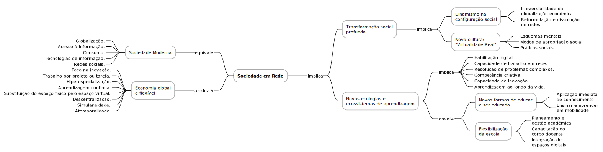

# Sociedade em Rede e os Novos Desafios da Educação

A *sociedade em rede* emergiu como uma realidade transformadora, alterando profundamente a forma como as pessoas se relacionam, comunicam, trabalham e aprendem. Este fenómeno reflete uma mudança paradigmática, impulsionada pelas tecnologias digitais, que remodela as estruturas sociais, económicas e culturais.

Entre os principais pensadores deste tema, destaca-se Manuel Castells, cuja obra, incluindo a trilogia "A Era da Informação: Economia, Sociedade e Cultura" [^1] e "A Galáxia Internet"[^2], fornece uma análise abrangente das dinâmicas da sociedade em rede. Castells explora como a revolução digital redefine as interações humanas, os modelos económicos e a produção cultural, sublinhando o papel central das redes na organização contemporânea.

Neste contexto de transformação, a educação emerge como um pilar essencial para preparar cidadãos capazes de navegar os desafios e oportunidades da era digital. Mais do que uma simples adaptação ao digital, a educação enfrenta o imperativo de inovar: redesenhar práticas pedagógicas, criar ambientes de aprendizagem dinâmicos e formar professores aptos a explorar as potencialidades tecnológicas. Esta transição exige uma abordagem holística, onde a tecnologia não é apenas um instrumento, mas um catalisador para promover a colaboração, a personalização da aprendizagem e o desenvolvimento de competências críticas para a participação ativa na sociedade em rede.

[^1]: Castells, M., (2003). A Era da Informação, Volumes I, II, e III, Fundação Calouste Gulbenkian.
[^2]: Castells, M., (2004). A Galáxia Internet, Fundação Calouste Gulbenkian.