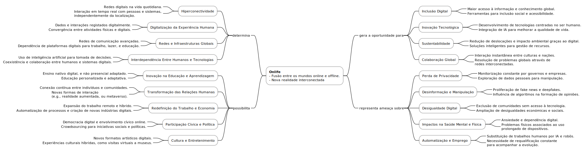

# A Realidade Hiperconectada e a Educação Online

Em 2013[^1], sob a liderança de Luciano Floridi, foi publicado o *The Onlife Manifesto*, que introduziu o conceito de **onlife**. Este termo reflete a fusão entre a vida online e offline, propondo uma nova abordagem ética e política que reconhece a crescente interdependência entre estes dois mundos. O manifesto defende que, numa sociedade cada vez mais digital, onde a distinção entre o online e o offline se torna difusa, é fundamental reformular os paradigmas éticos e políticos para enfrentar os desafios da hiperconectividade.

Esta integração profunda entre os mundos online e offline tem repercussões significativas na educação, que enfrenta o desafio de se reinventar para acompanhar as exigências da sociedade em rede. A educação online, ou à distância, destaca-se como um pilar desta transformação, possibilitando a aprendizagem em qualquer lugar e a qualquer hora, e promovendo uma maior inclusão e acessibilidade. Contudo, a verdadeira inovação reside em compreender a educação online não apenas como uma ferramenta para disseminar conteúdos, mas como uma oportunidade de transformação pedagógica.

Neste contexto, a educação deve evoluir para criar ambientes que não apenas transmitam conhecimento, mas também potenciem a interatividade, a colaboração e a personalização. O uso das tecnologias digitais deve permitir o desenvolvimento de experiências de aprendizagem mais envolventes e diversificadas, ajustadas às necessidades individuais dos estudantes. Além disso, é essencial capacitar os alunos com competências digitais críticas, fundamentais para a participação ativa e responsável numa sociedade em rede. Este movimento requer uma visão integrada, onde o conceito de onlife inspire práticas educativas que reflitam a complexidade e as oportunidades da era digital.

[^1]: O conceito foi explorado numa obra mais completa, também editada por Luciano Floridi, intitulada "The Onlife Manifesto: Being Human in a Hyperconnected Era" (2015).
