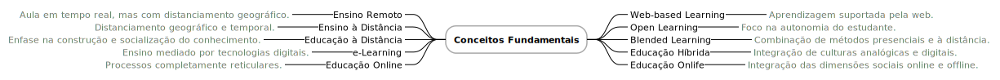

# O Paradigma da Educomunicação

A Educomunicação, na interseção entre educação e comunicação, surge como uma abordagem inovadora que promove a participação ativa e crítica de estudantes no processo de aprendizagem. Inspirado na obra de Mario Kaplún[^1], este conceito defende que a educação deve ser um espaço de diálogo reflexivo, incentivando uma tomada de consciência crítica sobre a realidade. Num mundo onde a informação circula de forma descentralizada, a Educomunicação destaca-se como uma ferramenta essencial para formar cidadãos capazes de interpretar, questionar e co-criar conhecimento, competências indispensáveis na era digital. Autores como Manuel Castells[^4] e Pierre Lévy[^5] sublinham o papel transformador das redes e tecnologias digitais na educação, incentivando uma abordagem mais dinâmica e interconetada.

A centralidade da aprendizagem em comunidade reforça esta abordagem, valorizando a partilha de experiências e a construção coletiva de conhecimento. Em sociedades hiperconetadas, o impacto das tecnologias digitais exige uma aprendizagem colaborativa e autónoma, fatores essenciais para enfrentar os desafios de um mercado de trabalho em constante transformação. Modelos como o blended learning e a educação online ilustram esta integração, combinando metodologias tradicionais com práticas digitais inovadoras, permitindo a transição entre culturas analógicas e digitais.

Para compreender o papel da Educomunicação, é importante distinguir conceitos como ensino remoto, ensino à distância e educação digital. O ensino remoto, caraterizado por distanciamento geográfico dos intervenientes, difere do ensino à distância, que é estruturado e assente no distanciamento geográfico e temporal. Por outro lado, modalidades como o e-learning e o web-based learning utilizam a tecnologia como mediadora central do processo educativo[^2]. Mais recentemente, abordagens como a educação OnLife[^3] integram dimensões online e offline, promovendo experiências de aprendizagem mais completas e adaptadas às necessidades atuais.

A aplicação prática da Educomunicação requer estratégias concretas que incentivem a interação, a colaboração e o pensamento crítico. Exemplos como projetos interdisciplinares mediados por tecnologia ou a criação de comunidades de aprendizagem online demonstram como esta abordagem pode ser implementada para potenciar o envolvimento e a autonomia dos estudantes. Ou seja, a Educomunicação não é apenas uma resposta às exigências da era digital, mas também um convite à construção de um futuro educativo mais democrático e inclusivo.

[^1]: Kaplún, M. (1998). Una Pedagogía de la Comunicación, Ed. de la Torre.
[^2]: Moreira, J., Schlemmer, E. (2020). Por um novo conceito e paradigma de educação digital onlife, Revista UFG, Goiânia, v. 20, n. 26.
[^3]: L. Floridi (2023). The Onlife Manifesto: Being Human in a Hyperconnected Era, Springer.
[^4]: Castells, M., (2003). A Era da Informação, Economia, Sociedade e Cultura - Volume I, Fundação Calouste Gulbenkian.
[^5]: Lévy, P. (1997). Cibercultura, Instituto Piaget.
