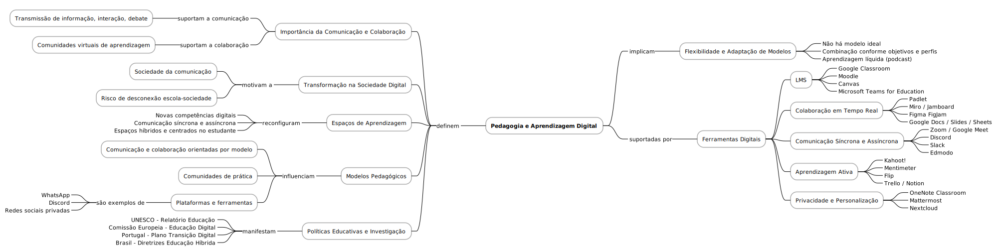

# Comunicação e colaboração digital

A comunicação e a colaboração digital desempenham um papel central na reconfiguração da educação no contexto contemporâneo. No planeamento das chamadas Coreografias Digitais, a identificação dos objetivos de aprendizagem, das competências a desenvolver e dos ambientes de aprendizagem a utilizar já pressupõe a criação de redes comunicativas eficazes e intencionais. A colaboração, por sua vez, emerge como uma força que alimenta comunidades virtuais de prática e aprendizagem, ultrapassando as limitações físicas da sala de aula tradicional. O uso estratégico de ferramentas digitais permite que estudantes e docentes construam conhecimento de forma partilhada, promovendo interações síncronas e assíncronas que valorizam a diversidade de ritmos e estilos de aprendizagem.

Neste cenário digital, o professor atua como arquiteto de experiências de aprendizagem híbridas, desenhando espaços flexíveis, centrados no estudante e adaptáveis aos novos desafios da era digital[^1]. A identificação das estratégias de aprendizagem dos alunos e a definição de performances esperadas — etapas visíveis nas Coreografias Digitais — devem alinhar-se com modelos pedagógicos que favoreçam a comunicação horizontal, a partilha de responsabilidades e a coautoria de conhecimento. Ferramentas como Google Docs, Padlet, Discord ou Microsoft Teams não são apenas suportes tecnológicos; são ecossistemas que facilitam a criação de sentido comum e a construção colectiva.

Ao mesmo tempo, a escolha das metodologias e recursos, tal como previsto na etapa de "Colocação em Cena", deve considerar a inclusão digital e o tipo de acessibilidade necessário. As plataformas de gestão da aprendizagem (LMS) como Moodle ou Canvas, combinadas com ambientes activos como Kahoot! ou Mentimeter, oferecem aos docentes meios para mediar, avaliar e dinamizar a participação dos alunos. O uso destas tecnologias exige não só competências digitais, mas também uma reflexão crítica sobre o seu impacto na cultura escolar e na equidade do acesso à educação.

Por fim, a transformação digital da educação requer um alinhamento claro entre prática pedagógica, investigação e políticas públicas. A referência a documentos estratégicos como o Plano de Educação Digital da Comissão Europeia ou as diretrizes da UNESCO[^2] mostra que a colaboração digital deve ser pensada a longo prazo, num espírito de "aprendizagem líquida", onde o conhecimento se estende no tempo e no espaço. Esta flexibilidade exige não a aplicação de um modelo único, mas a combinação criteriosa de ferramentas, metodologias e intenções pedagógicas ajustadas aos perfis de alunos e docentes, respeitando a complexidade dos contextos educativos actuais.

[^1]: Laurillard, D. (2012). Teaching as a Design Science: Building Pedagogical Patterns for Learning and Technology. Routledge.
[^2]: UNESCO. (2021). Reimagining our futures together: A new social contract for education.[https://unesdoc.unesco.org/ark:/48223/pf0000379707](https://unesdoc.unesco.org/ark:/48223/pf0000379707).
