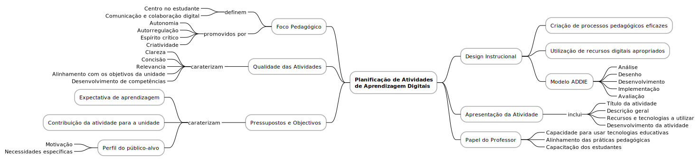

# Planificação de atividades de aprendizagem digitais

A planificação de atividades de aprendizagem digitais deve assentar numa abordagem centrada no estudante, promovendo a sua participação ativa, autonomia e desenvolvimento de competências relevantes para o século XXI. Para tal, é essencial que o desenho das atividades tenha em consideração a clareza, a concisão e a relevância dos objetivos propostos, alinhando-se com os pressupostos do que se espera que os alunos aprendam e contribuindo diretamente para os resultados de aprendizagem da unidade curricular. O foco deve estar igualmente na comunicação e na colaboração em ambientes digitais, aspetos cruciais para a construção conjunta do conhecimento.

Neste contexto, destaca-se a importância do modelo ADDIE (*Analyze, Design, Develop, Implement, and Evaluate*), inspirado no modelo ADDIC (*Analyze, Design, Develop, Implement, and Control*)[^1], proposto para desenvolvimento curricular em contexto interdisciplinar. O modelo ADDIE fornece uma estrutura metodológica sólida para a conceção de atividades pedagógicas digitais: a fase de análise permite identificar o público-alvo, as suas motivações e necessidades; o planeamento garante o alinhamento com os objetivos da unidade e o desenvolvimento de competências específicas; o desenvolvimento das atividades deve integrar recursos e tecnologias adequadas; a avaliação deve permitir a monitorização e melhoria contínua do processo de aprendizagem.

O papel do professor é determinante neste processo. Cabe-lhe apresentar claramente a unidade, definindo o título da atividade, uma descrição geral, os recursos e tecnologias a utilizar e as etapas de desenvolvimento. Além disso, o docente deve estar capacitado para integrar eficazmente as tecnologias digitais, ajustando as suas práticas pedagógicas e apoiando os estudantes no uso autónomo e crítico das ferramentas digitais. A formação contínua do professorado em competências digitais é, por isso, um elemento-chave para o sucesso da educação digital.

De acordo com Meirbekov, Maslova e Gallyamova (2022)[^2], a utilização de ferramentas digitais tem um impacto positivo no desenvolvimento do pensamento crítico dos estudantes, sendo um aliado importante na promoção da criatividade, autorregulação e pensamento racional. Estes resultados reforçam a necessidade de integrar intencionalmente tecnologias digitais no planeamento pedagógico, não apenas como apoio técnico, mas como catalisadores de aprendizagens significativas e transformadoras em ambientes educativos digitais.

[^1]: Branson, R. K., Rayner, J. A., Cox, J. L., Furman, J. M., King, F. J., Hannum, W. H., & Gagne, R. M. (1975). Interservice procedures for instructional systems development, Washington, DC: U.S. Department of Defense, https://apps.dtic.mil/sti/citations/ADA019486.
[^2]: Meirbekov, A., Maslova, I. & Gallyamova, Z. (2022) Digital education tools for critical thinking development. Thinking Skills and Creativity, 42, https://doi.org/10.1016/j.tsc.2022.101023.