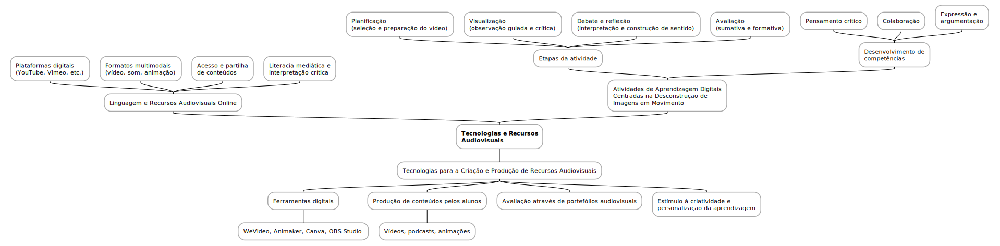

# Tecnologias e Recursos Audiovisuais

As tecnologias e os recursos audiovisuais online desempenham um papel cada vez mais central na educação contemporânea, oferecendo novas linguagens e formatos de comunicação que se adaptam ao perfil dos estudantes atuais. Plataformas digitais como o YouTube, Vimeo, WeVideo ou Animaker, entre outras, permitem o acesso e a produção de conteúdos audiovisuais com relativa facilidade e baixo custo. Estes recursos possibilitam uma maior aproximação entre o conteúdo educativo e a realidade mediática dos alunos, facilitando a compreensão, a atenção e o envolvimento nos processos de ensino-aprendizagem. A linguagem audiovisual, com a sua combinação de imagem, som e narrativa, amplia as possibilidades expressivas e cognitivas, sendo particularmente eficaz na abordagem de temas complexos ou abstractos.

As atividades de aprendizagem digitais centradas na desconstrução de imagens em movimento constituem uma metodologia ativa que promove o pensamento crítico, a interpretação e a construção de sentido. Estas atividades organizam-se geralmente em quatro etapas — planificação, visualização, debate/reflexão e avaliação — e envolvem o uso pedagógico de vídeos educativos, escolhidos com base na sua pertinência e qualidade. Durante a visualização, os alunos são convidados a observar criticamente o conteúdo, identificando elementos visuais, sonoros e narrativos que sustentam a mensagem. Segue-se o debate, em que partilham interpretações, exploram diferentes perspetivas e aprofundam a relação entre os vídeos e os conteúdos curriculares. Este processo não só estimula a aprendizagem significativa, como também desenvolve competências transversais como a argumentação, a empatia e a colaboração.

Por outro lado, as tecnologias para a criação e produção de recursos audiovisuais oferecem aos docentes e alunos ferramentas para a elaboração dos seus próprios materiais didáticos. A produção de vídeos, podcasts ou animações, por exemplo, permite aos estudantes apropriarem-se ativamente do conhecimento, reforçando o seu papel enquanto produtores de conteúdo e não apenas consumidores. Estas tecnologias promovem a personalização da aprendizagem e incentivam a criatividade, ao mesmo tempo que integram processos de avaliação contínua, como o feedback formativo ou a construção de portefólios audiovisuais. Ao combinar o uso crítico de media com metodologias participativas, criam-se ambientes educativos mais dinâmicos, colaborativos e alinhados com os desafios do século XXI.

## Temas
- [Linguagem e Recursos Audiovisuais Online](04_01_linguagem_e_recursos_audiovisuais_online.md)
- [Atividades de Aprendizagem Digitais Centradas na Desconstrução de Imagens em Movimento](04_02_atividades_de_aprendizagem_digitais_centradas_na_desconstrucao_de_imagens_em_movimento.md)
- [Tecnologias para a Criação e Produção de Recursos Audiovisuais](04_03_tecnologias_para_a_criacao_e_producao_de_recursos_audiovisuais.md)