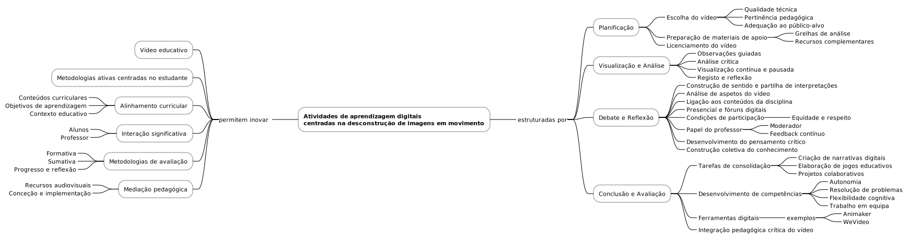

# Atividades de aprendizagem digitais centradas na desconstrução de imagens em movimento

A criação de atividades de aprendizagem digitais com base na desconstrução de imagens em movimento constitui uma abordagem inovadora que alia o uso do vídeo educativo a metodologias ativas centradas no estudante. Estas atividades devem estar alinhadas com os conteúdos curriculares, os objetivos de aprendizagem e o contexto educativo, promovendo a interação significativa entre alunos e professor. A avaliação, tanto formativa como sumativa, permite aferir os progressos, identificar aspetos a melhorar e fomentar a reflexão sobre o percurso de aprendizagem. O conhecimento sobre o processo de conceção e implementação destas atividades permite ao docente explorar eficazmente os recursos audiovisuais como ferramentas de mediação pedagógica[^1].

A estrutura destas atividades assenta em quatro etapas principais: planificação, visualização e análise, debate e reflexão, e conclusão com avaliação. Na fase de planificação, o professor escolhe o vídeo com base na sua qualidade técnica, pertinência pedagógica e adequação ao público-alvo. Deve preparar materiais de apoio como grelhas de análise e recursos complementares, assegurando que o vídeo está licenciado para uso educativo. Durante a visualização, os alunos realizam observações guiadas e análises críticas, apoiadas por materiais que contextualizam os conteúdos abordados. Esta etapa deve ser estruturada em momentos distintos de visualização contínua e pausada, com espaço para registo e reflexão.

O debate posterior é uma fase essencial de construção de sentido, em que os estudantes partilham as suas interpretações, analisam diferentes aspetos do vídeo e estabelecem ligações com os conteúdos da disciplina. Esta discussão pode decorrer presencialmente ou em fóruns digitais, desde que se garantam condições de participação equitativas, respeito mútuo e cumprimento de normas estabelecidas. Cabe ao docente o papel de moderador, incentivando a argumentação fundamentada e assegurando feedback contínuo. A diversidade de perspetivas e o confronto de ideias promovem o desenvolvimento do pensamento crítico e a construção coletiva de conhecimento[^2].

Na fase final, os estudantes são convidados a realizar tarefas que consolidem as aprendizagens e estimulem a criatividade, como a criação de narrativas digitais, a elaboração de jogos baseados no conteúdo do vídeo ou a proposta de projetos colaborativos. Estas atividades potenciam competências como a autonomia, a resolução de problemas, a flexibilidade cognitiva e o trabalho em equipa. Assim, a integração crítica e pedagógica do vídeo nas práticas de ensino-aprendizagem representa uma via promissora para aprofundar a participação dos estudantes e enriquecer o ambiente educativo.

[^1]: Mayer, R. E. (2020). Multimedia learning (3rd ed.). Cambridge University Press.
[^2]: Duffy, P., & Bruns, A. (2006). The use of blogs, wikis and RSS in education: A conversation of possibilities. In A. Bruns & S. Jacobs (Eds.), Uses of Blogs (pp. 31-44). Peter Lang.
