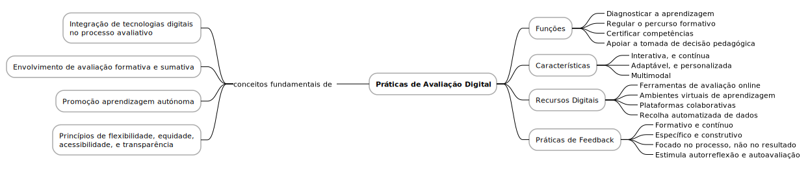

# Práticas de Avaliação Digital

As práticas de avaliação digital assentam na utilização de tecnologias digitais para recolher, analisar e interpretar evidências de aprendizagem. Estas práticas são orientadas por princípios fundamentais como a flexibilidade, a equidade, a acessibilidade e a personalização, permitindo uma avaliação mais centrada no aluno. A avaliação digital pode assumir um carácter formativo, acompanhando o processo de aprendizagem em tempo real, ou sumativo, visando aferir os resultados finais. Entre as suas funções estão a regulação da aprendizagem, o apoio à tomada de decisão pedagógica e a promoção da autonomia e autorregulação dos alunos.

Do ponto de vista das suas características, a avaliação digital distingue-se pela sua natureza interativa, contínua e adaptável. Facilita a diversificação dos formatos de resposta, desde elementos visuais a produções multimédia, o que possibilita uma abordagem mais inclusiva e diferenciada. Além disso, permite a recolha automática de dados e a análise sistemática do progresso do aluno ao longo do tempo. Esta forma de avaliação favorece ainda a transparência e a objetividade, uma vez que pode ser suportada por critérios bem definidos e mecanismos automatizados de correção e feedback.

No que respeita aos recursos utilizados e às práticas de feedback associadas, a avaliação digital apoia-se numa variedade de instrumentos que permitem criar contextos avaliativos ricos e dinâmicos. Estes recursos devem ser utilizados com intencionalidade pedagógica, articulando-se com os objetivos de aprendizagem e os critérios de avaliação. O feedback digital, enquanto parte integrante deste processo, deve ser claro, construtivo e orientador. Deve ainda incentivar a reflexão, a autoavaliação e o envolvimento ativo do aluno na sua própria aprendizagem, promovendo uma cultura de melhoria contínua e responsabilização.

## Temas
- [Conceitos, Princípios, Funções e Características da Avaliação Digital](05_01_conceitos_principios_funcoes_e_caracteristicas_da_avaliacao_digital.md)
- [Recursos de Avaliação Digital e Práticas de Feedback](05_02_recursos_de_avaliacao_digital_e_praticas_de_feedback.md)
