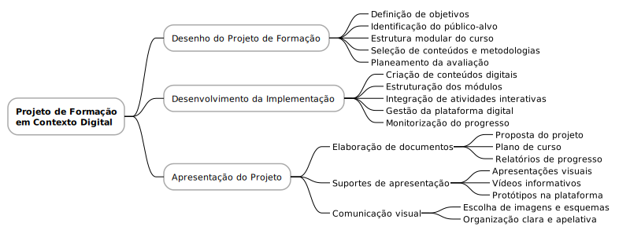

# Projeto de Formação em Contexto Digital

O desenho do projeto de formação em contexto digital é a etapa que estabelece as bases pedagógicas, metodológicas e operacionais da intervenção formativa. Nesta fase, define-se o público-alvo, os objetivos gerais e específicos, os conteúdos a abordar, a duração da formação, os critérios de avaliação e os recursos necessários. É essencial garantir que o projeto seja coerente, realista e adequado às necessidades dos formandos, promovendo uma aprendizagem significativa e adaptada ao ambiente digital.

O desenvolvimento da implementação do projeto de formação em plataforma digital exige uma planificação cuidada, que inclua a organização dos módulos, a construção dos conteúdos e atividades, bem como a integração de elementos interativos e colaborativos. A adaptação ao formato digital requer atenção à acessibilidade, à usabilidade da plataforma e ao suporte técnico e pedagógico. É importante assegurar a articulação entre formadores e participantes, criando um ambiente virtual que favoreça a motivação, o envolvimento e a autonomia na aprendizagem.

A apresentação do projeto de formação em plataforma digital deve ser clara, apelativa e estruturada, permitindo uma compreensão rápida dos seus objetivos, metodologias e benefícios. A utilização de elementos visuais e comunicativos adequados facilita a divulgação e captação de interesse por parte do público-alvo. Para isso, é necessário selecionar os suportes de apresentação mais eficazes, articulando diferentes meios de comunicação que transmitam de forma eficiente o valor e a pertinência do projeto formativo.

## Temas
- [Desenho do Projeto de Formação](06_01_desenho_do_projeto_de_formacao.md)
- [Desenvolvimento da Implementação do Projeto de Formação em Plataforma Digital](06_02_desenvolvimento_da_implementacao_do_projeto_de_formacao_em_plataforma_digital.md)
- [Apresentação do Projeto de Formação em Plataforma Digital](06_03_apresentacao_do_projeto_de_formacao_em_plataforma_digital.md)