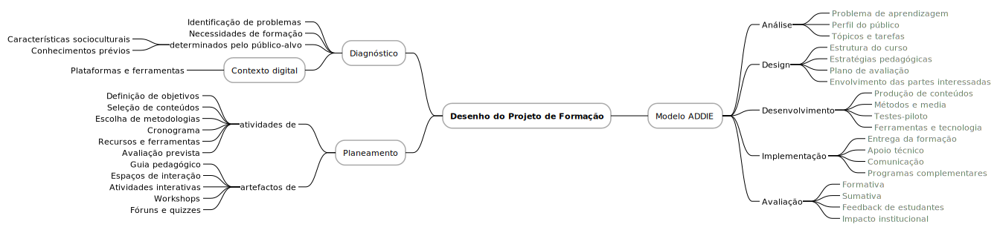

# Desenho do Projeto de Formação

O desenho de um projeto de formação em contexto de educação digital não parte de uma fórmula fixa, mas sim de uma realidade específica e singular que exige uma estrutura inédita e flexível. A essência do projeto reside na sua natureza processual e na ausência de um modelo pré-estabelecido para os envolvidos, diferenciando-se de um plano tradicional por privilegiar a experimentação e a adaptação. O ponto de partida é sempre o diagnóstico, pois é este que fundamenta e justifica a necessidade da formação, orientando a construção de objetivos claros e metas mensuráveis, com foco na aprendizagem significativa e contextualizada[^1].

Neste contexto, o modelo ADDIE (Análise, Desenho, Desenvolvimento, Implementação e Avaliação) oferece uma estrutura robusta para o desenho instrucional. Na fase de análise, identificam-se o público-alvo, as necessidades formativas, as competências a desenvolver e os constrangimentos técnicos. O design organiza o conteúdo, define as estratégias pedagógicas, os métodos de avaliação e estabelece o alinhamento com as partes interessadas. Já o desenvolvimento transforma essas decisões em materiais e recursos concretos, enquanto a implementação garante o acesso equitativo e a comunicação eficaz com os formandos[^2].

A avaliação, presente em todas as etapas do modelo ADDIE, permite ajustes contínuos com base em feedback e resultados concretos. A avaliação formativa possibilita melhorias em tempo real, e a avaliação sumativa analisa o impacto global do projeto, inclusive em termos institucionais. Esta prática reflexiva garante a evolução do projeto, com base na análise do que funcionou e do que deve ser melhorado. É, assim, essencial promover uma atitude crítica e de autoregulação, orientando a formação para a melhoria contínua da experiência de aprendizagem[^3].

O planeamento deve ser um processo estruturado, porém flexível, permitindo revisões e adaptações conforme as necessidades emergentes. Este envolve a definição de objetivos, seleção de conteúdos, escolha de metodologias, cronograma, ferramentas e artefactos pedagógicos como guias, fóruns, workshops e atividades interativas. Todo o desenho deve centrar-se na aprendizagem, garantindo a coerência entre o diagnóstico inicial, os resultados previstos e as atividades propostas. A intencionalidade do planeamento é, portanto, essencial para uma formação digital eficaz, significativa e sustentável.

[^1]: Perrenoud, P. (1999). Construir competências desde a escola. Porto: ASA.
[^2]: Branch, R. (2009). Instructional design: The ADDIE approach. Springer.
[^3]: Anderson, L., & Krathwohl, D., Airasian, P., Cruikshank, K., Mayer, R., Pintrich, P., Raths, J., & Wittrock, M. (2000). A taxonomy for learning, teaching, and assessing: A revision of Bloom's taxonomy of educational objectives. Pearson.