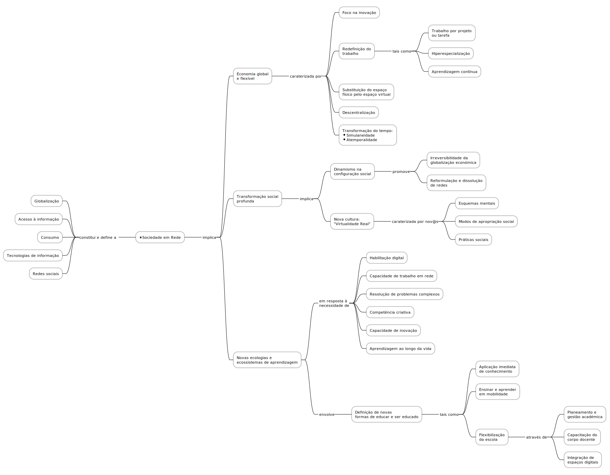

# Sociedade em Rede e os Novos Desafios da Educação

A *sociedade em rede* é uma realidade que se impõe e que tem vindo a transformar a forma como as pessoas se relacionam, comunicam, trabalham e aprendem.

A discussão contemporânea sobre a sociedade em rede tem no trabalho de Manuel Castells uma das suas referências fundamentais, através das suas obras, nomeadamente a triologia "A Era da Informação: Economia, Sociedade e Cultura", e "A Galáxia Internet", onde explora as transformações sociais, económicas e culturais provocadas pela revolução digital.

A educação, como um dos pilares fundamentais da sociedade, não pode ficar alheia a estas mudanças, e a educação digital surge como uma resposta a estes novos desafios, procurando explorar as potencialidades das tecnologias digitais para promover a aprendizagem e o desenvolvimento dos alunos.

