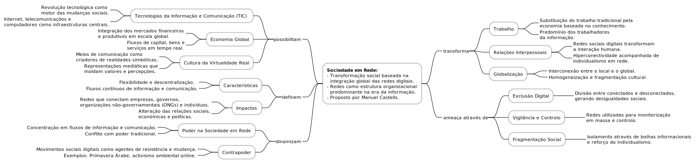

# Sociedade em Rede e Educação Digital

A expressão *sociedade em rede* representa a centralidade do conceito de rede na organização e funcionamento da sociedade contemporânea. As redes são estruturas que se encontram presentes em todos os domínios da vida social, desde a economia, à política, à cultura, à educação, e à comunicação. Efetivamente, são as redes de comunicação digitais que permitem a interação e a partilha de informação em tempo real, em qualquer lugar do mundo, que tem vindo a transformar a forma como as pessoas se relacionam, comunicam, trabalham, e aprendem.

Esta transformação oferece oportunidades e desafios à sociedade. Por um lado, a sociedade em rede permite a criação de novas formas de organização e de colaboração, a emergência de novas práticas culturais e artísticas, e a inovação em áreas como o empreendedorismo, ciência, e educação. Por outro lado, a sociedade em rede coloca desafios relacionados com a privacidade, segurança, desinformação, e desigualdade, que exigem respostas eficazes por parte dos cidadãos, organizações, e governos.

Em relação à educação, é necessário transformar a forma como se ensina e se aprende. Esta transformação passa pela utilização de tecnologias digitais, com vista a permitir a criação de ambientes de aprendizagem mais interativos, colaborativos, personalizados, flexíveis, e acessíveis, que respondem às necessidades e interesses de estudantes e professores, promovendo a aquisição e desenvolvimento de competências digitais essenciais para a participação ativa na sociedade em rede.

## Temas
- [Sociedade em Rede e os Novos Desafios da Educação](01_01_sociedade_em_rede_e_os_novos_desafios_da_educacao.md)
- [A Realidade Hiperconectada e a Educação Online](01_02_a_realidade_hiperconectada_e_a_educacao_online.md)
- [O Paradigma da Educomunicação](01_03_o_paradigma_da_educomunicacao.md)
- [A Inovação em Educação Digital](01_04_a_inovacao_em_educacao_digital.md)